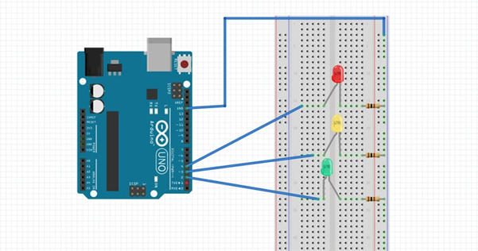

# Arduino Traffic Light System

A traffic light simulator built with an **Arduino UNO** and three LEDs. The system cycles through Red, Yellow, and Green signals with realistic timing, making it an ideal beginner project for learning Arduino programming and basic electronics.

## Features

- Standard traffic light cycle: **Red -> Yellow -> Green -> Yellow -> repeat**
- Configurable timing for each signal phase
- Clean, well-documented Arduino sketch
- Simple breadboard circuit with minimal components

## Circuit Diagram



## Tech Stack

- **Hardware:** Arduino UNO, LEDs, 220 ohm resistors, breadboard
- **Language:** C++ (Arduino)
- **IDE:** Arduino IDE or PlatformIO

## Project Structure

```
├── src/
│   └── Traffic_Light_System/
│       └── Traffic_Light_System.ino   # Main Arduino sketch
├── docs/
│   ├── setup.md                       # Hardware & software setup guide
│   └── architecture.md               # System design documentation
├── assets/
│   └── circuit_diagram.png            # Wiring diagram
├── .github/
│   ├── workflows/ci.yml              # CI workflow
│   ├── ISSUE_TEMPLATE/               # Issue templates
│   └── pull_request_template.md      # PR template
├── README.md
├── CONTRIBUTING.md
├── CHANGELOG.md
└── LICENSE
```

## Components Required

| Component       | Quantity | Purpose                       |
|----------------|----------|-------------------------------|
| Arduino UNO    | 1        | Microcontroller               |
| Breadboard     | 1        | Prototyping                   |
| Red LED        | 1        | Stop signal                   |
| Yellow LED     | 1        | Caution signal                |
| Green LED      | 1        | Go signal                     |
| 220 ohm Resistors | 3     | Current limiting for LEDs     |
| Jumper Wires   | 5        | Connections                   |

## Installation

### Prerequisites

- [Arduino IDE](https://www.arduino.cc/en/software) (v1.8+) or [Arduino CLI](https://arduino.github.io/arduino-cli/)
- USB cable for Arduino

### Upload the Sketch

1. Clone this repository:
   ```bash
   git clone https://github.com/mnoumanhanif/Arduino_Traffic_Light_System.git
   ```
2. Open `src/Traffic_Light_System/Traffic_Light_System.ino` in the Arduino IDE.
3. Select **Tools > Board > Arduino UNO**.
4. Select **Tools > Port > (your Arduino port)**.
5. Click **Upload**.

See [docs/setup.md](docs/setup.md) for detailed wiring and setup instructions.

## How It Works

The sketch configures three digital pins as outputs and runs an infinite loop:

| State  | LED    | Duration |
|--------|--------|----------|
| 1      | Red    | 3.0 s    |
| 2      | Yellow | 1.5 s    |
| 3      | Green  | 3.0 s    |
| 4      | Yellow | 1.5 s    |

Only one LED is active at any time. See [docs/architecture.md](docs/architecture.md) for the full state machine design.

## Testing

Since this is an embedded Arduino project, testing is performed by uploading the sketch to hardware:

1. Wire the circuit as shown in the [circuit diagram](assets/circuit_diagram.png).
2. Upload the sketch to your Arduino UNO.
3. Verify the LEDs cycle in the correct order with the expected timing.

The CI workflow compiles the sketch using `arduino-cli` to catch syntax and compilation errors.

## Contributing

Contributions are welcome! Please read [CONTRIBUTING.md](CONTRIBUTING.md) for guidelines on how to submit issues and pull requests.

## License

This project is licensed under the MIT License. See [LICENSE](LICENSE) for details.

## Author

**M Nouman Hanif** - [GitHub](https://github.com/mnoumanhanif)

## References

- [PiMyLifeUp - Arduino Traffic Light Project](https://pimylifeup.com/arduino-traffic-light-project/)
